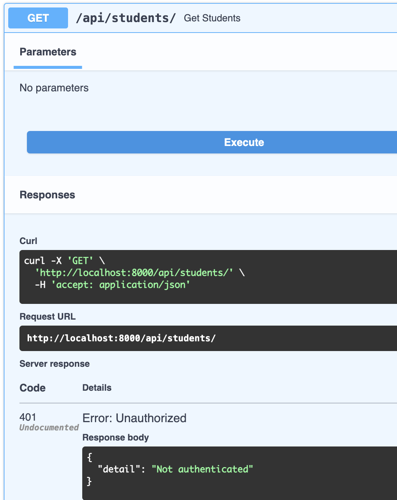
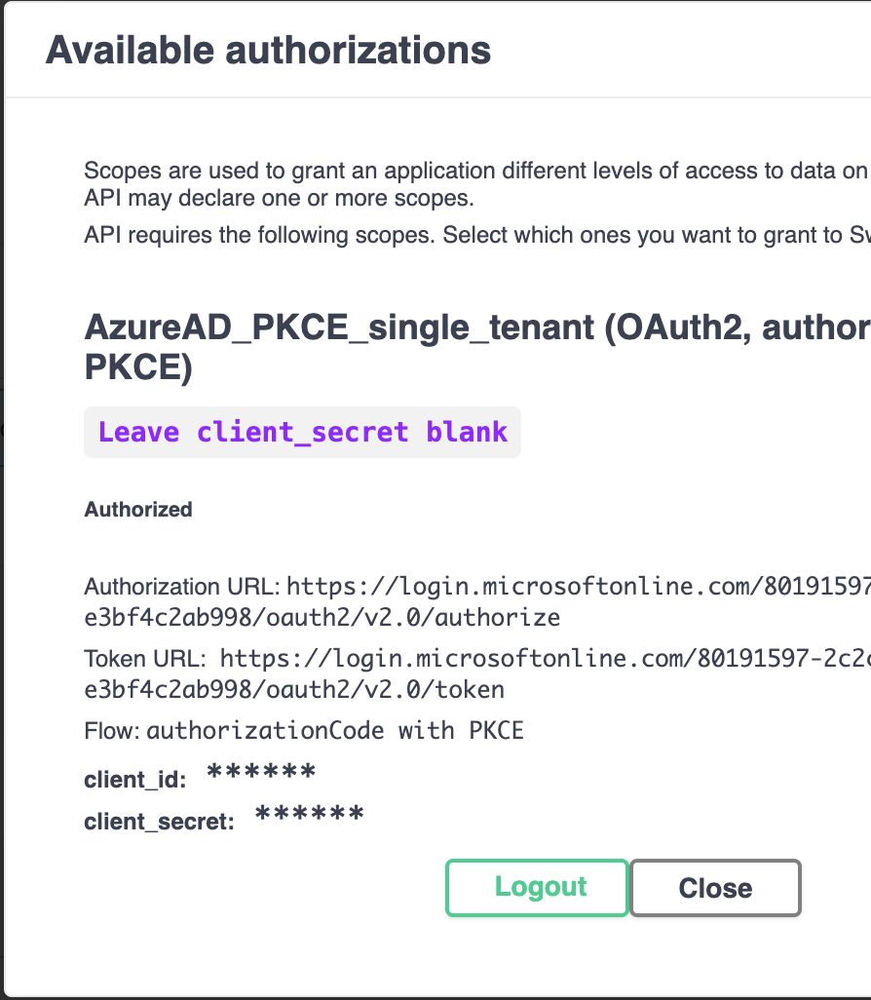
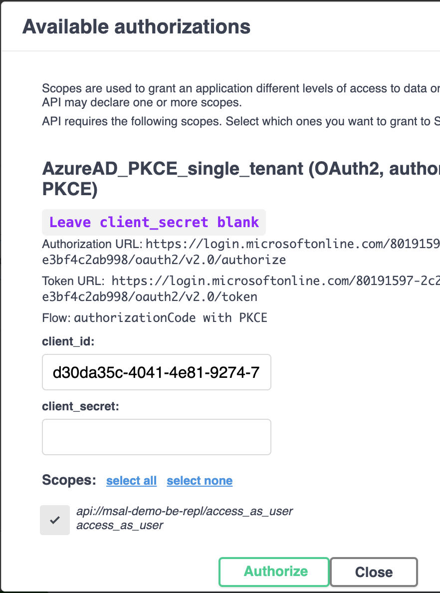
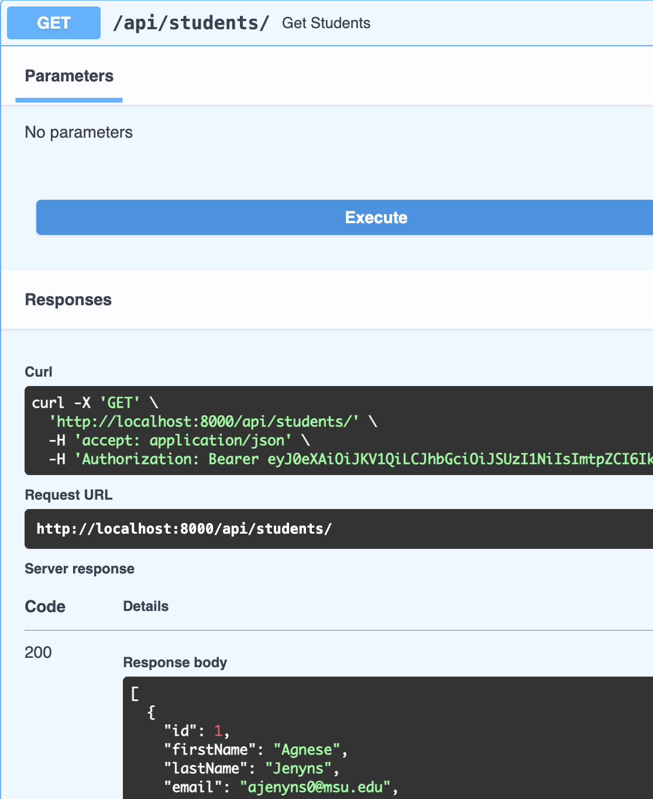
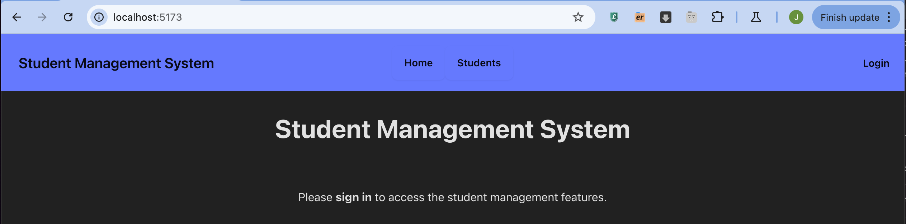
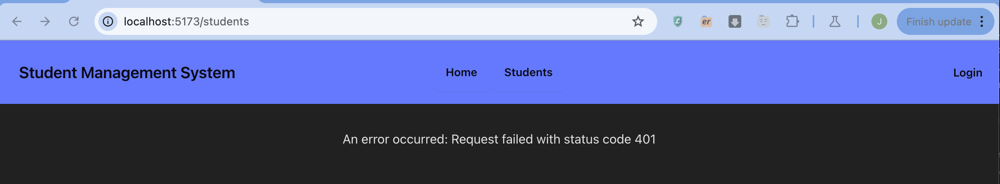
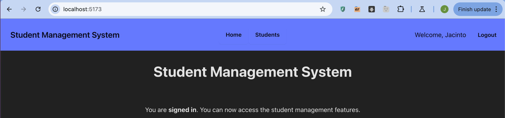
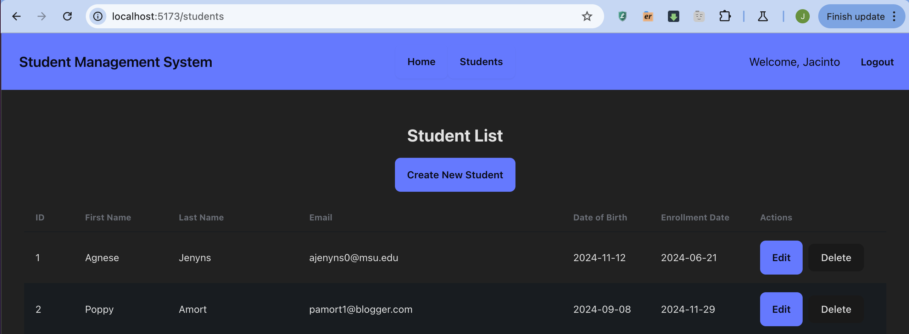

### MSAL Auth Example Demo
A simple Demo of using FastAPI (python), on the backend, and React+Vite on the frontend, using Microsoft Authentication Library (https://github.com/AzureAD/microsoft-authentication-library-for-js/)

I followed along to the tutorial by https://github.com/jade-codes/auth-made-easy/

*Requires creation of client app registrations in Azure*

#### Some screenshots:
##### Backend
BE Endpoints
![[be-Fastapi-endpoints.png]](screenshots/be-Fastapi-endpoints.png)

Routes are protected: 

After Authorizing: 

Before Authorizing: 

Can now access Protected Routes: 

#### Frontend

Front End without logging in 

Trying to access /students, which is a protected route: 

After logging in: 

Front-end CRUD of the backend: 

